# Astronomy Dashboard

## Purpose
We created this website as a means to obtain all kinds of info on astronomy into one spot. The website includes information such as weather, visibility, cloud coverage, current moon phase, constellations that are visible at this time of year, upcoming meteor showers, and the latest news in astronomy.

## Getting Started
To automatically have the website capture the user's location on load, the user must allow the browser to allow the permissions.

## Demo of Website

### User Stories

* **As a user** - When I visit the home page I am presented with a request to share my location  

-   
- 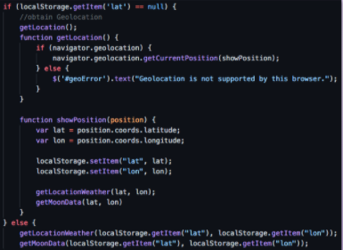  
- GeoLocation API (built-in)  
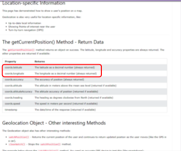  

* **As a user** - I want to see a dashboard of information - specifically weather data about visibility  

- 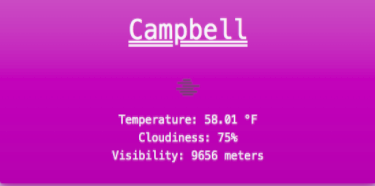  
- 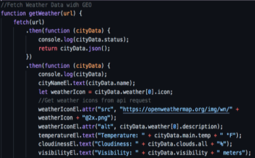  
- OpenWeatherMap API (server side)
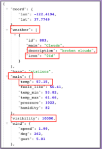  

* **As a user** - I want to be able to search for a city if I choose not to use geolocation   

- 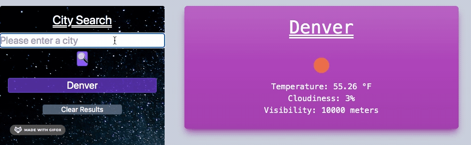  
-   

* **As a user** - I want to choose from a list of cities if I enter an invalid search term  

- 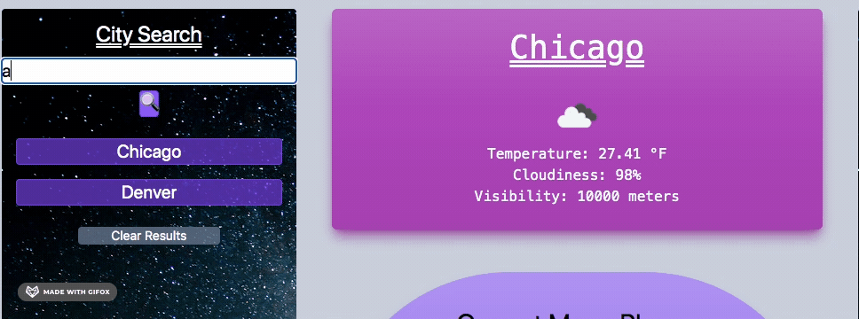  
- 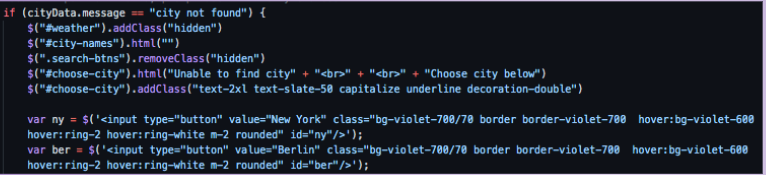  
- 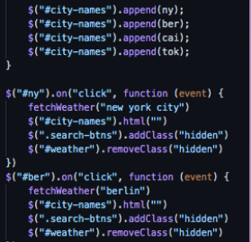  

* **As a user** - I want to see the current moon phase  

- 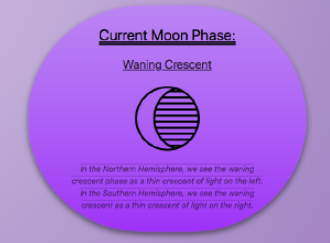  
- 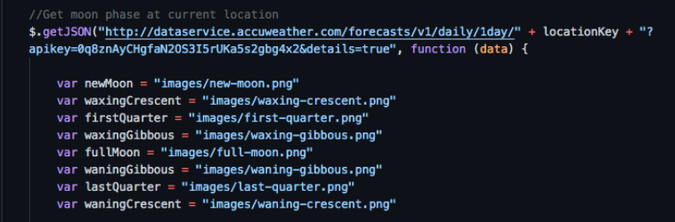  
- 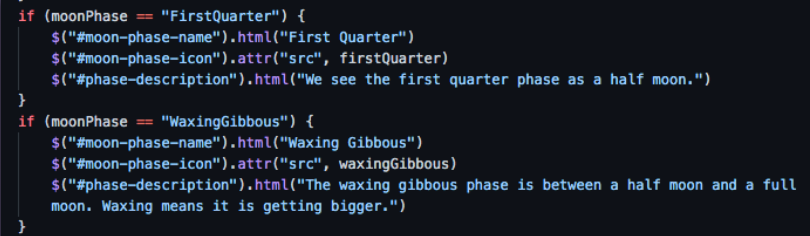  
- AccuWeather Location API  
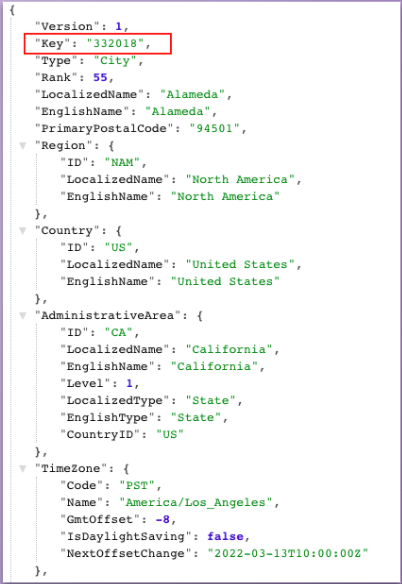  
- AccuWeather Forecast API (server side)  
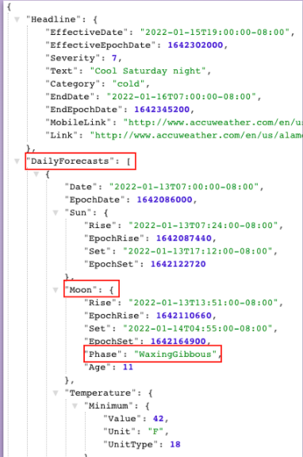    

* **As a user** - I want to see a table of upcoming meteor showers  

- 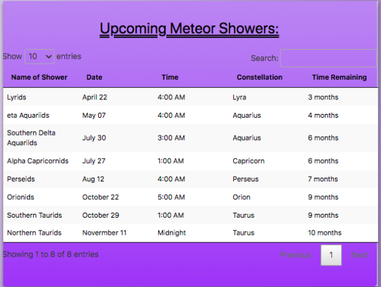  
- 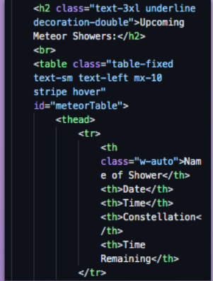  
- 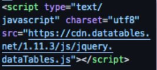  
- 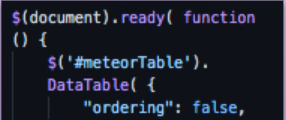  

* **As a user** - I want to see the NASA astronomy photo of the day  

- 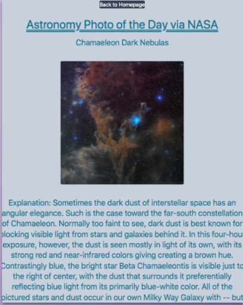  
-   
-   

* **As a user** - I want to know which constellations are visible this month  

- 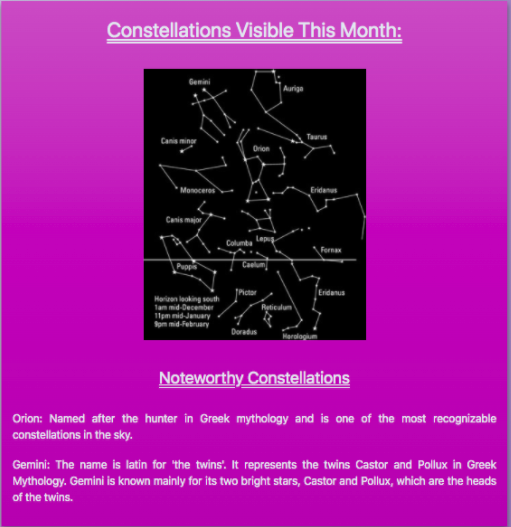  
- Hard coded info to HTML + utilizing MomentJS  
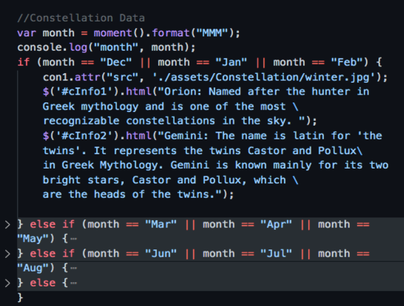  

* **As a user** - I want to see recent news articles about astronomy  

- 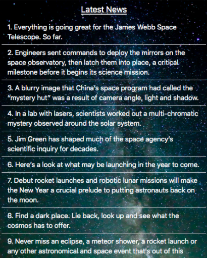  
- 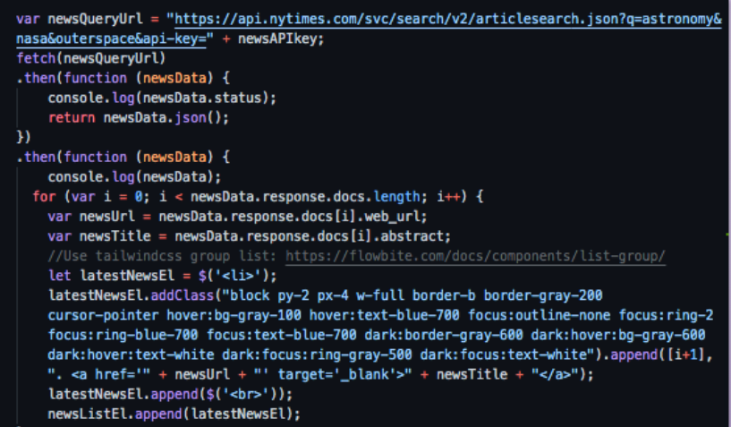  
- New York Times - Article Search API (Third Party)  
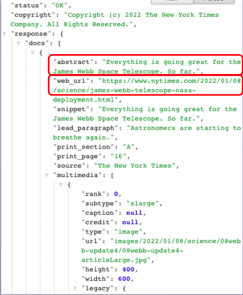  

### CSS Framework  
- [**TailwindCSS**](https://tailwindcss.com/docs)
-- A utility-first CSS framework packed with classes like flex, pt-4, text-center and rotate-90 that can be composed to build any design, directly in your markup

### Responsive Breakpoints  
-   

## Learning Objectives  
- Collaborative teamwork and healthy git workflow
- Group coding  
- GitHub branches  
- GitHub project cards  
- JavaScript libraries (DataTables, momentJS, jQuery)  
- Server side API's (OpenWeatherMap, AccuWeather, NASA)  
- Third party API's (NYT)
- CSS framework (TailwindCSS)

## Built With

* [HTML](https://developer.mozilla.org/en-US/docs/Web/HTML)
* [CSS](https://developer.mozilla.org/en-US/docs/Web/CSS)
* [JavaScript](https://developer.mozilla.org/en-US/docs/Web/javascript)
* [JQuery](https://developer.mozilla.org/en-US/docs/Glossary/jQuery)
* [Moment.js](https://momentjs.com/docs/)
* [TailwindCSS](https://tailwindcss.com/)
* [DataTables](https://datatables.net/)

# Deployed Link

The link to the deployed application is: https://dazedchou.github.io/Astronomy-Dashboard/

## Authors

**David Chou**

- Github： https://github.com/DazedChou/
- LinedIn： https://www.linkedin.com/in/davidchou99/

**Courtney Foster**

- Github： https://github.com/cfoster121
- LinedIn： https://www.linkedin.com/in/courtney-foster-0b364575/

**Baofeng Guo**

- Github： https://github.com/magickw
- LinedIn： https://www.linkedin.com/in/bfguo/

## License
This project is licensed under the MIT License

## Credits
* [W3 Schools](https://www.w3schools.com/)
* [MDN Web Docs](https://developer.mozilla.org/en-US/)
* [Gif Application](https://gifox.io/)
* [Flat Icon Royalty Free Images](https://www.flaticon.com/)
* [Remove Background App](https://www.remove.bg/)
* [Open Weather API](https://openweathermap.org/api)
* [AccuWeather API](https://developer.accuweather.com/apis)
* [NASA API](https://api.nasa.gov/)

